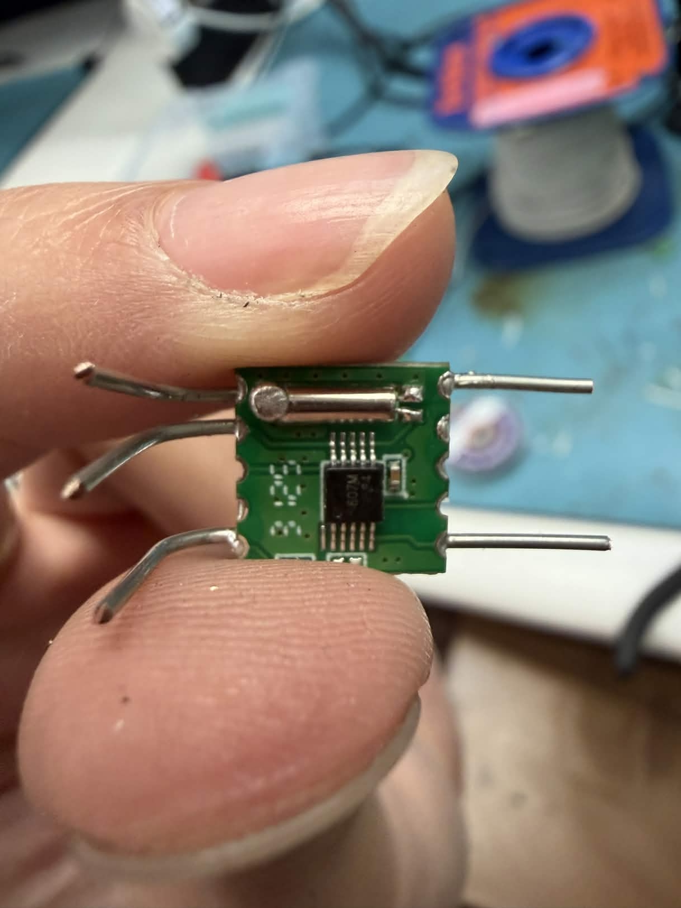
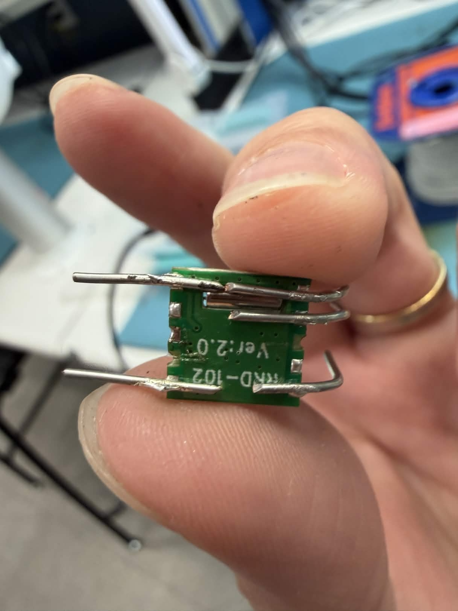

# FM Radio Explorer
**Developed by: Jacob Feenstra & Chun-Ho Chen**

The FM Radio Explorer is a hardware-software prototype that offers an exploratory music listening experience by bridging traditional FM signals with modern web metadata.

---

## Description 

The FM Radio Explorer has changed due to time & hardware constraints from it's initial proposal, but it still offers an exploratory music listening experience. In its current stage, it is a prototype with real capability to become a production-value system. Last.fm's public-facing API is still used to query metadata for a particular song, and the radio module is capable of tuning into FM radio signals and performing playback. Unfortunately, working with the RDA5870M radio module model proved more difficult than we anticipated, and we were not able to successfully solder it to the rest of the system. The replacement radio module we opted for does not support the Radio Data System protocol (RDS), which is crucial for being able to display information for the currently playing song. 

The current prototype is as follows: Last.fm offers a wide variety of metadata and points of musical exploration, a subset of which is displayed for a song of our choice, by querying the API endpoints with the track and artist name. The S10-S3 Univeral Remote and IR Receiver is configured for numerical & punctuation input, and writes to the radio module and plays a selected FM broadband (for example, 90.3 would correlate to 90.3 FM). The same remote will be used to switch between different OLED Display views, each of which displays different output from the Last.fm API (to be discussed in Section [sec:Design]). An antenna boosts signal gain, and a cheap 3.5 mm auxiliary headset can plug directly into the headphone jack of the radio module. The API developed for the OLED UI, paired with the IR Receiver code, enables the user to switch between different FM radios seamlessly. Note all of this is orchestrated with our Texas Instrument's CC3200 LaunchPad.

## Design

### Functional Specifications

As indicated above, the functional specification mainly revolves around two main categories: the use of the universal remote and the OLED display. All of the other technical details are hardware-specific (system architecture), or abstracted away from the user. You may notice in the diagrams that some functional/system specifications have been removed when compared against the proposal's specifications. This mostly stems from complications with dealing with a non-RDS compliant radio module, and we had to sacrifice some features (namely volume configuration, mute and unmute, and callsign multi-tap). We also added some features, most notably OLED view scrolling.

1. Universal Remote: A set of buttons are configured for the user to control the FM playback, as well as the current display on the OLED. The full input includes:

* Numerical buttons: Use the numerical buttons to specify the FM radio frequency. Buttons 0-9 map to these numbers. The puncutation is reserved for the ENTER button. For instance, to tune into 90.3 FM (our local college radio!), you would type in “90.3”, tapping the 0 button twice for the period.

* Enter button: Pressing the OK button sends the currently typed input (as described in a) to be queried against the radio module. If it matches with an FM broadband, that broadband will play! Any erroneous or unrecognized input prompts the user to try again with a red flash.

* Delete button: Delete the last character entered while input is pending. Note this is a nice to have, and if our Delete button is not working (something which occurred in Lab 3), we will simply opt for the user to recycle the input by pressing enter.

* Last button: Playback the last FM radio signal visited.

* Left Arrow: Navigate to an OLED view to the left. Each view will be accessible from a “banner menu” at the top of the OLED, not dissimilar to traditional graphical interfaces in software. Clicking the left arrow will “switch” to another view, which will refresh the entire OLED display and highlight the relevant entry on the banner. If at the end of the banner, left-clicking cycles to the rightmost entry in the banner.

* Right arrow: Similar functionality to the left arrow, but for the entry to the right of the current entry. If at the rightmost entry in the banner, right-clicking cycles to the leftmost entry in the banner.

* Up arrow: Scroll up 3 lines in the OLED View window. Protects against scrolling above the boundaries.

* Down arrow: Scroll down 3 lines in the OLED View window. Protects against scrolling past rendered content.

2. OLED Display: What is presented on the OLED display, and navigable by the left and right arrows on the remote. Since we did not have RDS support, for this prototype the relevant information is associated to a hardcoded track included in our backend. As new FM signals get typed, it cycles between 15 different tracks. For each track, live API calls are made each time which update the OLED Display accordingly; only the source of input (hardcoded versus RDS) is what has changed.

* Radio view: Shows the current FM radio playing, current song playing, the artist, and track progression. The progression bar is synced to the scrolling in the song lyrics view (see part g).

* Album cover view: Shows a 118x118 JPEG image of the album cover of the song currently playing, smoothed with bilinear interpolation.

* Similar artists view: Shows a list of similar artists (compared against the artist currently playing).

* Artist Biography: Shows biography of the artist currently playing

* Genre tags: Indicates genres of the current song playing.

* Similar tracks: Shows songs similar to the song currently playing. Also includes the artist for the song.

* Song lyrics: Uses a simpler system timer logic to support synced lyrics, pulling from the timestamps contained in the API endpoint output of the LRClib open-source lyrics database. The specifics of this will be discussed more in Section [subsec:OLED-Display-API].

* Scrolling indicators: Small magenta indicators on each view illustrate if there is more content above or below the current view.

### System Architecture

Using a Digital Signal Processing (DSP) Radio Module with an antenna, we reliably pick up on FM radiowaves in the greater Sacramento area. The DSP uses I2C to send carrier information to the microcontroller. Since the model does not support RDS, The radio playback and OLED display content are asychronous of each other, but this prototype illustrates that it would take minimal work to get them synced up with a supporting module.

The DSP also manages an analog path to the audio output. For the sake of prototype simplicity, we plug a headset into the audio output. Volume and gain would be managed at this point in the analog path for a final, production radio explorer. The DSP will also need two 4.7 kiloOhm resistors on it's I2C lines to ensure reliable response, for all aspects of the communication protocol (including audio playback).

The hardcoded demo code is inputted to the Last.fm API. HTTP GET responses fetch relevant song & artist information from the API endpoints. Each song entry has specially prepared synced lyrics to demonstrate our prototype. A final production-quality system would likely spend the fee to use the Musixmatch API, but for now, the hard-coded LRClib outputs provide a sufficient demonstration of how the synced lyrics work.

The Universal Remote and IR Receiver components are identical to Lab 3, with some additional inputs, seen in Section [subsec:Functional-Specification]. With these specifications, we can control the views on the OLED display, which will be populated by GET responses from the Last.fm API.

---

## Implementation

Implementation details are explained at a high-level, and forgoes specific C programming language details. It does delve into driver code details where applicable, since this informs our design.

### OLED Display API

The OLED UI module (oled_ui.c / oled_ui.h) is the sole owner of the 128x128 SSD1351 OLED display surface. Decisions for what is drawn, where, and in what color all live here. The rest of the firmware (the radio driver, the Last.fm client, the IR remote handler, and main.c itself) communicates with this module through it's API. Only the OLED UI issues drawing commands to the Adafruit GFX layer directly.

#### The View System

The module exposes seven named views, each corresponding to a distinct data category fetched during operation. Each view has a three-character banner abbreviation and its own internal data store. Only one view is active at a time. The active view value is held in a single module-level variable (an enum). Navigation calls cycle this variable and reset the associated scroll offset to zero, but do not repaint the screen. The render call that follows reads the current view ID and calls the appropriate internal draw function. This means that switching to the next view (input-driven) is a 2-API call process. Each view has an associated API endpoint to render this view, which are doucmented in oled_ui.h. 

There is a separation between data updates and rendering. Every update function writes new values into it's data store. None of them touch the OLED hardware. The single oled_ui_render() call is the only place where data is consumed and pixels are produced (OLED hardware is called here). We leverage this to call multiple update functions in sequence before committing a single visual frame to the display.

#### Text Engine

All drawing is built on top of the Adafruit GFX methods (fillRect, drawPixel, drawChar, drawFastHLine, drawFastVLine). The Adafruit 5x7 bitmap font at size 1 IS USED, giving each character a 6x8 pixel region (5 pixels wide plus a 1-pixel gap) and each text row a 9-pixel height (8 pixels tall plus a 1-pixel gap). Text views (biography, lyrics, etc) are rendered in the folllowing way: on a render call, the engine first counts the total number of wrapped lines the stored text produces. It then renders only the subset of lines that fall within the visible window defined by the current scroll offset. Wrapping respects hard newlines in the source string and falls back to a soft break at the last space before the column limit if a word would overflow the line. The scroll position is clamped during this pass so that attempting to scroll down the last line of content is always safe. When a view's content extends above or below the display window, a small magenta indicator dot is painted at the top-right or bottom-right corner of the screen to indicate that more content exists in that direction.

#### Album Cover Rendering

The album cover requires two modules working in sequence. The Last.fm client (Last.fm.c) handles the network side: it downloads the JPEG from the Last.f CDN, decodes the HTTP response to extract the raw image bytes, and passes a pointer to those bytes along with their length to oled_ui_render_album_jpeg(). From that point, everything is the OLED UI module's responsibility.

The raw bytes are handed to stb_image, which decodes them into a flat array of 24-bit RGB pixels. Then, it determines computes scale parameters that fit the decoded image into the content area while preserving the original aspect ratio. If the image is wider than it is tall, the width is constrained to 128 pixels and the height scales proportionally; if it is taller, the height is constrained to 116 pixels. Any remaining border is left black. The stb_image decoding is the most complicated pipeline anywhere in our entire codebase, and consists of approximately 8,000 lines of code which preprocesses the raw JPEG for OLED display use. This library is taken entirely from [https://github.com/nothings/stb||Sean T. Barrett's public-domain C/C++ libraries]. Specifically stb_image.h. We prepared a source file to use the main header file, and that is virtually all the integration that was needed.

The scaled image is written to the OLED using bilinear interpolation with a tunable sharpness. This helps to balance blurriness at small display sizes without introducing the pixel-grid artifacts of pure nearest-neighbour scaling (a pretty ugly grid-like pattern). All of the pixels are passed through this filter before being drawn to the OLED.

Because the CC3200 has limited RAM, stb_image is configured to use a static pool allocator rather than the heap. The pool is reset before every decode call and again after the draw has completed, keeping the allocation self-contained to the given cycle.

#### Color Scheme

All colour values are in a single block of named aliases near the top of oled_ui.c. Changing the visual theme requires editing only this block; there are no other color literals in the code.

### SimpleLink & Last.fm API

The Last.fm API client module (lastfm.c / lastfm.h) is responsible for all network communication in the FM Radio Explorer. When the user tunes to a station and the current artist and track title are known, this module gets track metadata from the Last.fm public REST API and pushes the results into the OLED UI. It also downloads and pre-processes the album cover JPEG so that the OLED UI module can decode and display it.

lastfm.c owns everything on the network side: DNS resolution, TCP socket management, HTTP request construction and transmission, JSON parsing, and more. oled_ui.c owns everything on the pixel side: JPEG decoding via stb_image, aspect-ratio scaling, and more. The pipeline clearly transitions from network to pixel decoding & drawing.

All API calls target ws.audioscrobbler.com on plain HTTP port 80. JSON responses are typically two to eight kilobytes. Album cover art is fetched from the Last.fm CDN (lastfm.freetls.fastly.net) over a TCP socket. The HTTPS url stored in the API response is rewritten to HTTP to sidestep the our CC3200's TLS root-CA certificate limitations.

#### HTTP Layer

All communication with the Last.fm API goes through a single internal function, http_get_plain(). This function handles the complete request-response cycle for one HTTP GET and is reused for every API call. The SimpleLink sl_NetAppDnsGetHostByName() call is used to resolve the hostname to a 32-bit IP address. If resolution fails, LASTFM_ERR_DNS is returned immediately and no socket is created. A standard TCP socket is created with sl_Socket(). A receive timeout of LASTFM_RECV_TIMEOUT_MS (8 seconds by default) is applied via sl_SetSockOpt() before the connection attempt. The HTTP request is formatted as HTTP/1.0 with a Connection: close header so the server closes the connection after transmitting the response The response is read into s_http_buf in a loop using sl_Recv(). The loop exits when sl_Recv() returns zero (connection closed by server, the normal termination for HTTP/1.0), when the receive timeout fires, or when the buffer is full. A partial receive after at least some data has arrived is treated as the complete response rather than an error, allowing gracefully truncated responses to be parsed. After the loop, the buffer is null-terminated and the total byte count is returned. A shared helper, http_skip_headers(), locates the end of the HTTP headers by scanning for the standard carriage-return-newline carriage-return-newline sequence. It also extracts the numeric HTTP status code from the first response line. The returned pointer addresses the first byte of the response body. If the status code is 200, we move on to our Last.fm query functions to actually extract the data.

#### JSON Parsing

The Last.fm REST API returns JSON. Our CC3200 has limited RAM and no standard C library JSON parser, so lastfm.c implements three lightweight extraction routines. All operate directly on the raw response buffer. json_get_string searches the response text for the pattern "key": and copies the value string that follows into an output buffer. It handles the standard JSON string escape sequences, converting whatever the CC3200 can interprety to their ASCII equivalent; anything not interpretable is repalced with a question mark (the OLED is ASCII-only). json_get_name_array extracts the "name" field from each object element of a named JSON array. It locates the array by key, then walks through each object element iteratively. The object is copied into a small buffer and json_get_string is called on it to extract the name. This is used for genre tags and similar artists, where each array element is a simple object with a name and a URL. json_get_track_array is a variant of json_get_name_array that handles track entries, which contain both a track name and a nested artist object. For each array element it extracts the top-level name field, then locates the nested artist object by its key and extracts the artist name field from within it.

#### Text Cleaning

Last.fm biography text is returned as HTML-decorated text. Two helper functions clean this text before it is stored in the UI data structures.

#### Four API Calls

Each query for a track and artist from the FM radio makes 4 API calls.

#### track.getInfo

Fetches metadata for the current track and is the only source of the album-art URL. The autocorrect=1 parameter is included so that minor spelling differences in artist or track names are silently corrected by Last.fm. The corrected names are used for all subsequent API calls. Genre tags are extracted from the toptags.tag array and pushed to the Genre Tags view. The album image URL is located within the album object's image array. The module iterates through the image entries and prefers the "medium" size (64x64 pixels). If the URL uses HTTPS or ends in .png, it is rewritten to HTTP and .jpg respectively before being cached, working around the CC3200's TLS certificate chain limitation.

#### artist.getInfo

Fetches metadata for the corrected artist name. The artist biography is extracted from the bio.summary field, specificlaly the shorter version. Artist-level genre tags are also extracted from this response and overwrite the track-level tags set by the previous call, since they are higher quality (in our experience).

#### artist.getSimilar

Fetches a list of similar artists using the dedicated artist.getSimilar endpoint. This is a separate API call rather than using the similar-artists list embedded in the artist.getInfo response because that embedded list is hard-capped at five entries by the API. This can return up to 10 entries. The list is stored in the Similar Artists view.

#### track.getSimilar / artist.getTopTracks

This call attempts track.getSimilar first. As of 2025, this endpoint frequently returns an empty list even for well-known tracks. If fewer than two results are returned, the call falls back automatically to artist.getTopTracks for the same artist. If both attempts return no data, a placeholder entry is stored and the function still returns LASTFM_OK so that other views are not affected.

### Album Cover Fetch

LastFM_RenderAlbumCover() is called by main.c after the user navigates to the Album Cover view, provided LastFM_AlbumArtAvailable() is true. The function does not render pixels itself; it just downloads the JPEG bytes and delivers them to oled_ui_render_album_jpeg(). The cached image URL in s_img_url is split into hostname and path components by parse_url(). A TCP socket is opened to the image host using the same DNS-resolve, create, set-timeout, and connect sequence used for API calls. The full HTTP response (headers plus image body) is received into the dedicated 20 KB s_jpeg_buf buffer. The socket is closed immediately after the receive loop exits. If chunked encoding is detected, the body is decoded in-place: the module walks a read cursor through the chunk size headers and chunk data blocks, copying each chunk's data to a write cursor that lags behind. The final decoded byte count replaces the raw received length. The first bytes of the decoded output are logged over UART to confirm that 0xFF 0xD8 is present. After decoding, we have the module verify the JPEG SOI marker (0xFF 0xD8) one final time. If it is absent, LASTFM_ERR_JPEG is returned. If present, oled_ui_render_album_jpeg(s_jpeg_buf, img_len) is called, passing the pointer and byte count. From this point the OLED UI module assumes decode and draw process, using stb_image to decompose the JPEG into pixels and the bilinear scaler to fit them onto the content area.

### IR Receiver Interrupts and Remote Input

This is virtually identical to the code from Lab 3, with the exception of having a larger set of inputs and not utilizing multi-tap. Please refer to our Lab 3 report for further details.

### main() Event Loop

#### Initialization Sequence:

First, peripheral devices are brought up: board vectors, pin multiplexing, Wi-Fi, SPI, and UART. The Adafruit SSD1351 driver is initialized, then the OLED UI module, and lastly the TEA5767 radio module (default tuning at 90.3 MHz, and the OLED UI is updated accordingly). The IR receiver is then initialized, and the Last.fm API client is fed it's API key. query_lastfm() get called to fetch metadata for the current track on 90.3 and populdate all data stores to reflect this current track. Then it's all rendered to the OLED!

#### Query Last.fm helper

The query_lastfm() function is the bridge between the Last.fm network client and the OLED UI module. It calls the endpoint responsible for executing the Last.fm API calls and internally calls all the necessary oled_ui* calls to update each view. It also calls the data for the synced lyrics.

#### Tune and Update Helper

When the user enters a new frequency, tune_and_update()is called. It first validates the frequency against the FM band limits. If the frequency is out of range, it provides visual error feedback, then restores the display to its previous state. If the frequency is valid, the TEA5767 driver is instructed to retune, the signal strength is read back, query_lastfm() is called to refresh all metadata views, and the Radio view is updated and rendered with the new station label and signal level.

#### IR Remote Event Loop

This is most of the code in main.c; main() enters an infinite polling loop. On each iteration it checks whether the IR receiver has completed decoding a button press. If so, the raw RC5 code is decoded to a logical command and sent to a switch statement. For digits 0-9 and the dot button, each digit is appended to a frequency entry buffer. The station field is immediately updated with a live preview string prefixed by > , and the Radio view is rendered to show the progress. For SELECT (Enter), if a frequency entry is in progress, the buffer is parsed and tune_and_update() is called with the result. If the buffer cannot be parsed (it contains only a decimal point), our error module is called and the display reverts to the last valid state. If no entry is in progress, SELECT simply forces the Radio view. LEFT / RIGHT calls oled_ui_navigate_left() or oled_ui_navigate_right() followed by oled_ui_render(). If the newly active view is the Album Cover view and artwork has already been fetched, LastFM_RenderAlbumCover() is called immediately to display the JPEG. UP / DOWN calls oled_ui_scroll_up() or oled_ui_scroll_down() followed by oled_ui_render(). MUTE toggles the mute state on the TEA5767 driver. No OLED update is triggered. Note this is stale code and didn't make it to our prototype, but it does work with the TEA5767 driver code. Lastly for LAST (Delete), if a frequency entry is active, it removes the last digit from the buffer and updates the preview.

#### Radio Module

We had many challenges with our original radio module, so we had to emergency purchase another module that had similar functionality. The benefits of the new module is that it also came with the amplifier circuit and a headphone jack. We learned over experimenting was that with the module constantly running at 5V, there was no reasonable way for the I2C lines of the TI-Launchpad to communicate with the module. We decided to implement a proof-of-concept instead. There was already a setup designed using an Arduino and its 5V lines to command the module, so we decided to have 2 separate systems, where one was to communicate with the Screen + IR Receiver, and the other was to communicate to the Arduino using UART. Even thought they could not happen at the same time with out current model, they would reasonably be able to happen with the right FM module. There was an additional issue with the Arduino UART signals continuing to also be for 5V, but we put a voltage divider so the TI-Launchpad could receive the correct signals.

---

## Challenges

While there were many challenges, we focus on the most prominent ones, which easily took up 90%+ of our time in attempting to solve (successfully or unsuccessully)

### JPEG Decompression Library and Image Display

We had a very difficult time getting the JPEG image to work; it was expected this would be the most complicated component of the entire project, and indeed it was. Issues mainly stemmed from the fact that Last.fm's fastly CDN for album covers only server progressive JPEGs, and not baseline JPEGs. This proved difficult, since most CC3200-compatible JPEG decompression/decoding libraries only support baseline. Luckily, there was stb_image, but we had to work through two other libraries (TJpegDec and JPEGDEC, refactoring the driver code of one entirely!) before we settled on this final library. After memory pooling issues (during this project, we had RAM issues with the microcontroller around 50 or so times), we got the image to display!

### Synced Lyrics

Unfortunately, the best candidate for an open-source, non-commerical web service providing lyrics for songs is LRClib. While excellent, it does not provide support for TLS v1.2 certificates, and strictly communicates over HTTPS, meaning that our API calls were simply incompatible. We ended up hard-coding the results of endpoints in our demonstration code (seen in DEMO/), and that worked pretty effectively for a prototype. We used a simple GP Timer to sync it with the progress bar and create a time distribution based on the time stamps. You can see the response from the API in our demo code.

### Radio Module Implementation

#### RRD-102 with RDA5807M FM Module

With the original radio module we received, there were immediately many issues that hurt our ability to gain any progress. While not looking into it too much originally, we realized that the module is a Surface Mount Device (SMD). We originally purchased 4, and the first 2 were burned because I tried connecting them to a protoboard alongside their side holes. This would cause the copper pads to heat up too much, and they were of such cheap quality that the pads themselves would lift up, causing the device to be unusable. With the 3rd module, we tried connecting to the back pads directly since that would be easier to solder, but unfortunately the issues still persisted. I lost the 4th one, so we had to resort to purchasing a different module.

#### TEA5767 FM Module

Since it came in a module package that was essentially plug and play, it was a lot easier in theory to implement than the previous module. However, we came across separate issues immediately. When I would try to communicate with the module, it would receive garbage date back. We tested it using an Arduino I had, and the system worked. We then went down a rabbit hole where:

* Assumed pull-up resistors in the launchpad were inadequate, tried to connect to the chip 3.3V and 5V

* Tried adding high value (~5k) resistors

* Tried adding low value (~330) resistors

We realized that since it was an entire module rather than just a single chip required to be running on 5V. The pull up resistors that were part of the modules were forcing the signals to that specification (~3.5V-4V), which was above the needed <~3.3 required to communicate with the launchpad, and nothing we additionally implement was going to fix that issue. This forced us into the design change listed above.

---

## Future Work

### RDS-supported Radio Module

With our current setup our FM Module does not have the capabilities to read off metadata coming from the FM signals coming in. If we had however, it would have a simple addition to add a couple lines of code to read that source data and connect it directly to the Lastfm API. 

### Potentiometer-controlled Audio Playback

If we were allowed to use a similar radio chip to the one originally envisioned, we had the parts to add an amplifier chip to it manually. From that point onward, we would have been able to adjust the volume by connecting a potentiometer to its output. 

### FM Session History

If RAM concerns are not too heavy, it would conceivably be trivial to allow for session history of previously visited FM signals, and even past tracks that have been played (and allowing the ability to revisit their metadata). This was originally a stretch goal and would be a cool initiative for next steps, once RDS is working.
