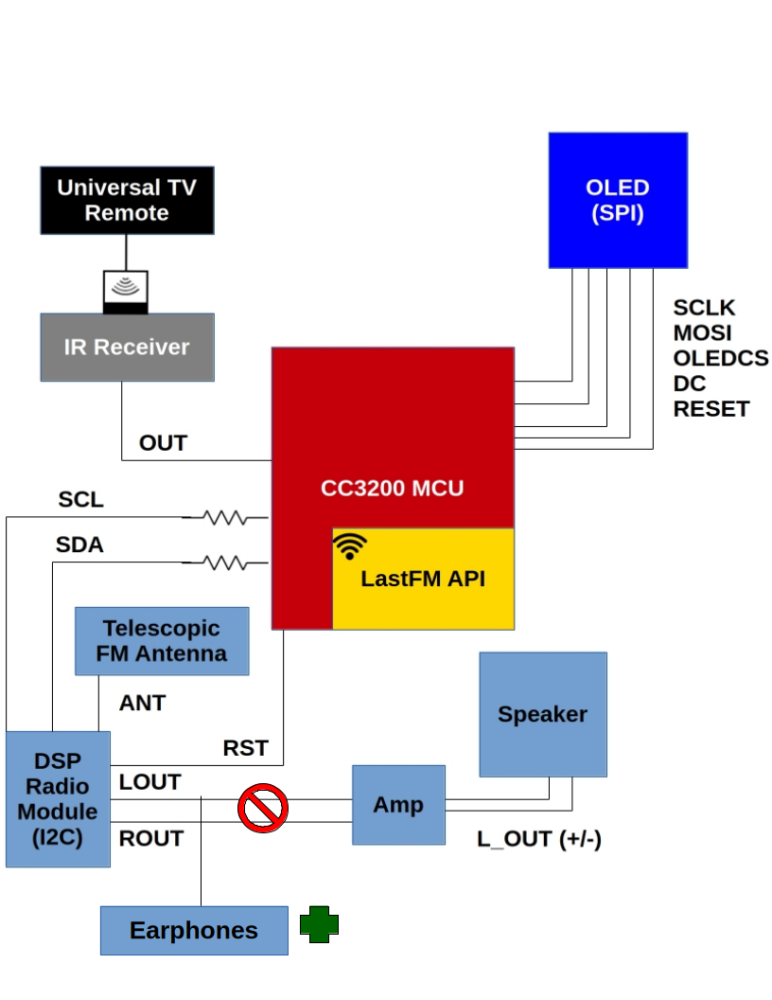

# FM Radio Explorer
## Jacob Feenstra & Chun-Ho Chen

Link to our [Demo](https://drive.google.com/file/d/109MXLAsd9JzWsAcxi5jvkkKnfmKOH1J9/view?usp=sharing)

## FM Radio Explorer

The FM Radio Explorer has changed due to time and hardware constraints from its initial proposal, but it still offers an exploratory music listening experience. In its current stage, it is a prototype with real capability to become a production-value system.

Last.fm's public-facing API is still used to query metadata for a particular song, and the radio module is capable of tuning into FM radio signals and performing playback. We are using a TEA5767 FM Stereo Chip as our Radio source

### Current Prototype

It is made of these components:

- **Last.fm API** — Offers a wide variety of metadata and points of musical exploration, a subset of which is displayed for a song of our choice by querying the API endpoints with the track and artist name.
- **S10-S3 Universal Remote, IR Receiver, SPI OLED Screen** — Configured for numerical and punctuation input, and writes to the radio module to play a selected FM broadband frequency (for example, `90.3` would correlate to 90.3 FM). The same remote is used to switch between different OLED Display views, each of which displays different output from the Last.fm API (discussed in the Design section).
- **Antenna** — Boosts signal gain for FM reception.
- **Audio Output** — A standard 3.5 mm auxiliary headset plugs directly into the headphone jack of the radio module.
- **TI Launchpad** - For connecting everything together, and for connecting to the Arduino
- **Arduino Nano** - For connecting the Arduino to the FM Module 

## System Architecture Overview (Current Status)

As indicated above, the functional specification mainly revolves around two main categories: the use of the universal remote and the OLED display. All of the other technical details are hardware-specific (system architecture), or abstracted away from the user. You may notice in the diagrams that some functional/system specifications have been removed when compared against the proposal's specifications. This mostly stems from complications with dealing with a non-RDS compliant radio module, and we had to sacrifice some features (namely volume configuration, mute and unmute, and callsign multi-tap). We also added some features, most notably OLED view scrolling.

## Design

As indicated above, the functional specification mainly revolves around two main categories: the use of the universal remote and the OLED display. All of the other technical details are hardware-specific (system architecture) or abstracted away from the user. You may notice in the diagrams that some functional/system specifications have been removed when compared against the proposal's specifications. This mostly stems from complications with dealing with a non-RDS compliant radio module, and we had to sacrifice some features (namely volume configuration, mute and unmute, and callsign multi-tap). We also added some features, most notably OLED view scrolling.

### 1. Universal Remote

A set of buttons are configured for the user to control the FM playback, as well as the current display on the OLED. The full input includes:

- **(a) Numerical buttons** — Use the numerical buttons to specify the FM radio frequency. Buttons 0–9 map to these numbers. The punctuation key is reserved for the ENTER button. For instance, to tune into 90.3 FM (our local college radio!), you would type in "90.3", tapping the 0 button twice for the period.

- **(b) Enter button** — Pressing the OK button sends the currently typed input (as described in a) to be queried against the radio module. If it matches with an FM broadband, that broadband will play! Any erroneous or unrecognized input prompts the user to try again with a red flash.

- **(c) Delete button** — Delete the last character entered while input is pending. Note this is a nice-to-have, and if our Delete button is not working (something which occurred in Lab 3), we will simply opt for the user to recycle the input by pressing enter.

- **(d) Last button** — Play back the last FM radio signal visited.

- **(e) Left Arrow** — Navigate to an OLED view to the left. Each view will be accessible from a "banner menu" at the top of the OLED, not dissimilar to traditional graphical interfaces in software. Clicking the left arrow will "switch" to another view, which will refresh the entire OLED display and highlight the relevant entry on the banner. If at the end of the banner, left-clicking cycles to the rightmost entry in the banner.

- **(f) Right Arrow** — Similar functionality to the left arrow, but for the entry to the right of the current entry. If at the rightmost entry in the banner, right-clicking cycles to the leftmost entry in the banner.

- **(g) Up Arrow** — Scroll up 3 lines in the OLED View window. Protects against scrolling above the boundaries.

- **(h) Down Arrow** — Scroll down 3 lines in the OLED View window. Protects against scrolling past rendered content.

### 2. OLED Display

What is presented on the OLED display, navigable by the left and right arrows on the remote. Since we did not have RDS support, for this prototype the relevant information is associated to a hardcoded track included in our backend. As new FM signals get typed, it cycles between 15 different tracks. For each track, live API calls are made each time which update the OLED Display accordingly; only the source of input (hardcoded versus RDS) is what has changed.

- **(a) Radio view** — Shows the current FM radio playing, current song playing, the artist, and track progression. The progression bar is synced to the scrolling in the song lyrics view (see part g).

- **(b) Album cover view** — Shows a 118×118 JPEG image of the album cover of the song currently playing, smoothed with bilinear interpolation.

- **(c) Similar artists view** — Shows a list of similar artists (compared against the artist currently playing).

- **(d) Artist biography** — Shows the biography of the artist currently playing.

- **(e) Genre tags** — Indicates genres of the current song playing.

- **(f) Similar tracks** — Shows songs similar to the song currently playing. Also includes the artist for the song.

- **(g) Song lyrics** — Uses a simpler system timer logic to support synced lyrics, pulling from the timestamps contained in the API endpoint output of the LRClib open-source lyrics database. The specifics of this will be discussed more in the OLED Display API section.

- **(h) Scrolling indicators** — Small magenta indicators on each view illustrate if there is more content above or below the current view.

## User Interaction & Program Use (Current Status)

## System Architecture

Using a Digital Signal Processing (DSP) Radio Module with an antenna, we reliably pick up on FM radio waves in the greater Sacramento area. The DSP uses I2C to send carrier information to the microcontroller. Since the model does not support RDS, the radio playback and OLED display content are asynchronous of each other, but this prototype illustrates that it would take minimal work to get them synced up with a supporting module.

The DSP also manages an analog path to the audio output. For the sake of prototype simplicity, we plug a headset into the audio output. Volume and gain would be managed at this point in the analog path for a final, production radio explorer. The DSP will also need two 4.7 kΩ resistors on its I2C lines to ensure reliable response for all aspects of the communication protocol (including audio playback).

The hardcoded demo code is inputted to the Last.fm API. HTTP GET responses fetch relevant song and artist information from the API endpoints. Each song entry has specially prepared synced lyrics to demonstrate our prototype. A final production-quality system would likely spend the fee to use the Musixmatch API, but for now, the hardcoded LRClib outputs provide a sufficient demonstration of how the synced lyrics work.

The Universal Remote and IR Receiver components are identical to Lab 3, with some additional inputs seen in the Functional Specification section. With these specifications, we can control the views on the OLED display, which will be populated by GET responses from the Last.fm API.

## Implementation 

Implementation details are explained at a high-level, and forgoes specific C programming language details. It does delve into driver code details where applicable, since this informs our design.

### OLED Display API 

The OLED UI module (oled_ui.c / oled_ui.h) is the sole owner of the 128x128 SSD1351 OLED display surface. Decisions for what is drawn, where, and in what color all live here. The rest of the firmware (the radio driver, the Last.fm client, the IR remote handler, and main.c itself) communicates with this module through it's API. Only the OLED UI issues drawing commands to the Adafruit GFX layer directly.

 #### The View System

The module exposes seven named views, each corresponding to a distinct data category fetched during operation. Each view has a three-character banner abbreviation and its own internal data store. Only one view is active at a time. The active view value is held in a single module-level variable (an enum). Navigation calls cycle this variable and reset the associated scroll offset to zero, but do not repaint the screen. The render call that follows reads the current view ID and calls the appropriate internal draw function. This means that switching to the next view (input-driven) is a 2-API call process. Each view has an associated API endpoint to render this view, which are doucmented in oled_ui.h. 

There is a separation between data updates and rendering. Every update function writes new values into it's data store. None of them touch the OLED hardware. The single oled_ui_render() call is the only place where data is consumed and pixels are produced (OLED hardware is called here). We leverage this to call multiple update functions in sequence before committing a single visual frame to the display.

#### Text Engine

All drawing is built on top of the Adafruit GFX methods (fillRect, drawPixel, drawChar, drawFastHLine, drawFastVLine). The Adafruit 5x7 bitmap font at size 1 IS USED, giving each character a 6x8 pixel region (5 pixels wide plus a 1-pixel gap) and each text row a 9-pixel height (8 pixels tall plus a 1-pixel gap). Text views (biography, lyrics, etc) are rendered in the folllowing way: on a render call, the engine first counts the total number of wrapped lines the stored text produces. It then renders only the subset of lines that fall within the visible window defined by the current scroll offset. Wrapping respects hard newlines in the source string and falls back to a soft break at the last space before the column limit if a word would overflow the line. The scroll position is clamped during this pass so that attempting to scroll down the last line of content is always safe. When a view's content extends above or below the display window, a small magenta indicator dot is painted at the top-right or bottom-right corner of the screen to indicate that more content exists in that direction.

#### Album Cover Rendering

The album cover requires two modules working in sequence. The Last.fm client (Last.fm.c) handles the network side: it downloads the JPEG from the Last.f CDN, decodes the HTTP response to extract the raw image bytes, and passes a pointer to those bytes along with their length to oled_ui_render_album_jpeg(). From that point, everything is the OLED UI module's responsibility.

The raw bytes are handed to stb_image, which decodes them into a flat array of 24-bit RGB pixels. Then, it determines computes scale parameters that fit the decoded image into the content area while preserving the original aspect ratio. If the image is wider than it is tall, the width is constrained to 128 pixels and the height scales proportionally; if it is taller, the height is constrained to 116 pixels. Any remaining border is left black. The stb_image decoding is the most complicated pipeline anywhere in our entire codebase, and consists of approximately 8,000 lines of code which preprocesses the raw JPEG for OLED display use. This library is taken entirely from [https://github.com/nothings/stb||Sean T. Barrett's public-domain C/C++ libraries]. Specifically stb_image.h. We prepared a source file to use the main header file, and that is virtually all the integration that was needed.

The scaled image is written to the OLED using bilinear interpolation with a tunable sharpness. This helps to balance blurriness at small display sizes without introducing the pixel-grid artifacts of pure nearest-neighbour scaling (a pretty ugly grid-like pattern). All of the pixels are passed through this filter before being drawn to the OLED.

Because the CC3200 has limited RAM, stb_image is configured to use a static pool allocator rather than the heap. The pool is reset before every decode call and again after the draw has completed, keeping the allocation self-contained to the given cycle.

#### Color Scheme

All colour values are in a single block of named aliases near the top of oled_ui.c. Changing the visual theme requires editing only this block; there are no other color literals in the code.

