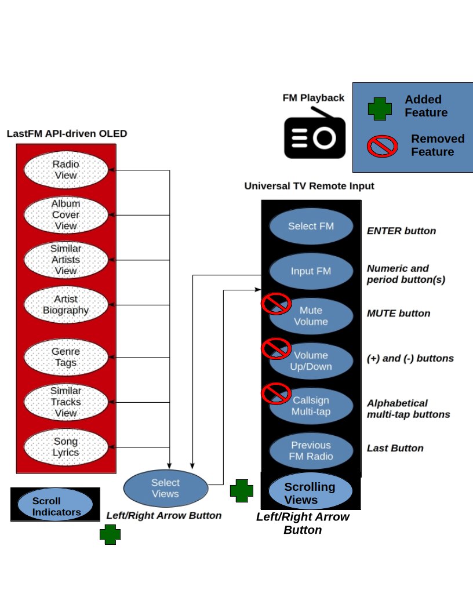

# FM Radio Explorer
**Developed by: Jacob Feenstra & Chun-Ho Chen**

The FM Radio Explorer is a hardware-software prototype that offers an exploratory music listening experience by bridging traditional FM signals with modern web metadata.

---

## System Overview
The current prototype leverages the **TI CC3200 Launchpad** and an **Arduino Nano** to coordinate between physical radio signals and cloud-based metadata.

### Core Components
| Component | Function |
|:---|:---|
| **TEA5767 FM Chip** | Handles FM signal tuning and audio playback. |
| **Last.fm API** | Fetches track metadata and artist biographies. |
| **SSD1351 OLED** | 128x128 SPI-driven display for the UI. |
| **S10-S3 Remote** | IR-based user input for frequency and navigation. |

---

## Architecture & Design
The system logic is divided between hardware-specific drivers and high-level UI management.

### System Flow

*Architecture of the functional specification and hardware abstraction.*

### 1. The View System (OLED API)
The firmware (specifically `oled_ui.c`) manages seven distinct views:
* **Radio View:** Current frequency and track progression.
* **Album Cover:** 118×118 JPEG rendering using `stb_image` for bilinear interpolation.
* **Synced Lyrics:** Uses LRClib timestamps synced via a system GP Timer.
* **Discovery:** Similar artists and genre tags fetched via HTTP GET.

### 2. Universal Remote Control
Input is handled via an IR Receiver using the **RC-6 protocol** (or similar logical mapping):
* **Numerical (0-9):** Specify frequencies (e.g., `90.3`).
* **Arrows:** Navigation through the "Banner Menu" and vertical text scrolling.
* **Mute/Last:** Controls for the TEA5767 driver.

---

## Implementation Details

### The Text Engine
To handle biographies and lyrics, we built a custom text engine on top of **Adafruit GFX**. It handles:
* **Soft Wrapping:** Prevents word-break mid-line.
* **Scrolling Indicators:** Magenta markers at screen corners indicate more content.
* **Optimization:** Only lines within the visible window are rendered to save cycles.

### Album Art Pipeline
The **CC3200** has limited RAM, making JPEG decompression difficult. 
> **Technical Note:** We implemented a static pool allocator for `stb_image` to avoid heap fragmentation during the 8,000+ lines of decompression logic.

---

## Challenges & Hardware Lessons
* **The "Progressive" JPEG Problem:** Last.fm's CDN serves progressive JPEGs, which many baseline libraries (TJpegDec) fail to decode. Switching to `stb_image` solved this.
* **I2C Voltage Mismatch:** The TEA5767 module forced 5V logic on I2C lines, requiring a hardware bridge (Arduino + Voltage Divider) to protect the TI-Launchpad's 3.3V pins.
* **The SMD Struggle:** Low-quality pads on early RRD-102 modules lifted during soldering, leading to the switch to the plug-and-play TEA5767 package.

---

## Future Work
* **RDS Support:** Integrating metadata directly from the FM carrier.
* **Potentiometer Integration:** Analog volume control via amplifier gain.
* **Session History:** Using RAM to store a history of visited signals.
